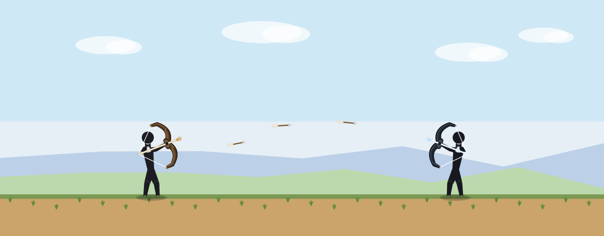

# Stickman Archers

[](https://github.com/Sourabh-Kumar-Rajput/StickMen/actions/workflows/ci.yml)

A browser-based stickman archery combat game inspired by *The Archers 2*. Built
with plain HTML5 Canvas + vanilla JavaScript — **no build step, no dependencies,
fully offline**. The same web build ships as an installable **PWA**, an **Android
app** (Capacitor), and a **desktop app** (Electron / Tauri).



## Play right now

**[▶ Play in your browser](https://sourabh-kumar-rajput.github.io/StickMen/)** — hosted
on GitHub Pages (enable it once via repo **Settings → Pages → Source: GitHub Actions**).

Or run it locally: **double-click `index.html`** (or drag it into any modern
browser). Works offline.

## Controls

- **Aim:** press-and-hold anywhere, then drag *backward* like pulling a bowstring.
- **Charge:** keep holding to charge — the bow flexes, the arrow glows, and the shot
  hits much harder (the ring at your hand fills up). Release to loose.
- **Power/arc:** the further you pull, the harder the shot (a dotted line previews it).
- **Ammo:** tap the bottom bar, or press number keys, to switch arrow type.
- **Shield:** tap 🛡 (or `Q`) to block incoming arrows from the front for a moment.
- **Pause:** `❚❚`, `Esc`, or `P`.  **Mute:** 🔊.

Headshots are instant kills; arrows arc under gravity, so lead moving targets.

## Features

- **Modes:** Duel · Survival (endless scaling waves, boss every 5) · Campaign
  (7 levels incl. a boss) · Custom (your own levels).
- **Charged bow + Armory:** hold to charge for more damage; earn **coins** from kills,
  wave clears, and wins, then spend them in the shop on stronger **bows**
  (Training → Hunter → Recurve → Composite → Dragon) and **elemental arrows**.
- **Elemental arrows:** normal, multi-shot (3-arrow spread), **fire** (burns over time;
  a burning corpse ignites nearby foes), **ice** (freeze), **poison** (stronger DoT),
  **air** (slow), **bomb** (AoE), **black hole** (a singularity that drags foes in and
  crushes them), plus spinning throwing **knives**. Bow power + charge scale damage.
- **Defense:** a raisable frontal shield blocks incoming arrows.
- **Enemies:** archer, runner, fast, tank (damage-resist), bomber (arcing bombs),
  shielded (frontal block), and **The Warlord** boss with telegraphed volley /
  charge / summon attacks across three HP phases.
- **Feel:** fixed 1280×720 virtual resolution letterboxed to any screen, unified
  mouse + touch input, procedural Web-Audio SFX + music, flat solid-black
  *The Archers 2*-style figures with a deep recurve bow,
  themed biomes (grassland / desert / snow / dungeon) with parallax + weather,
  blood / dust / explosion / glow particles, ragdoll deaths, screen shake.
- **Persistence:** localStorage high scores (survival wave + score, campaign
  progress + stars, duel streak) shown on the menu, plus a touch-friendly
  **level editor** to place enemies, save, and play custom levels.

## Project layout

| File | Responsibility |
|------|----------------|
| `index.html`, `css/style.css` | Shell, menus, HUD, editor/custom UI, PWA tags, SW registration |
| `js/utils.js`    | Math/draw helpers, the `VIEW` letterbox transform, `shade()` |
| `js/ragdoll.js`  | Verlet-physics ragdoll |
| `js/stickman.js` | Pose math (scalable), flat solid-black figure drawing + recurve bow, hitboxes |
| `js/weapons.js`  | `AMMO` + `BOWS` + `ELEM_COLOR` + charge/shield tuning |
| `js/arrow.js`    | Projectile (arrow/knife/explosive/bomb, elemental, charged) physics + render |
| `js/archer.js`   | Combatant: health/damage, status effects, per-type AI, ballistic aim, boss AI |
| `js/audio.js`    | `Sound`: procedural Web-Audio SFX + music (no audio files) |
| `js/storage.js`  | `Store`: coins/loadout + bests/settings/custom levels (safe fallback) |
| `js/game.js`     | Loop, input, charge, collision, elements, black holes, economy, themes, render |
| `js/editor.js`   | `Editor`: level editor |
| `js/shop.js`     | `Shop`: the Armory (buy/equip bows + arrows) |
| `js/main.js`     | `UI` + DOM wiring, lifecycle, Capacitor hooks |

## Tests

No browser needed — two headless harnesses:

```
node test/sim.js        # entity logic: ballistics, collision, damage, ragdoll, weapon kinds
node test/headless.js   # boots the FULL game under a stubbed DOM, drives every mode + editor + boss
```

Both run automatically on every push/PR via GitHub Actions (`.github/workflows/ci.yml`).

## Build as an app

The same files power all three targets. All asset paths are relative.

### 1) Installable PWA (offline, no toolchain)
The service worker (`sw.js`) needs http(s)/localhost — it is silently skipped on
`file://` (double-click still works, just without offline caching). To test the
PWA, serve over localhost and open `http://localhost:8000`:

```
npx http-server -p 8000 -c-1 .      # or: python -m http.server 8000
```

Then use the browser's "Install app" / "Add to Home Screen". After editing any
JS/CSS, **bump `CACHE` in `sw.js`** (cache-first serves the old bundle otherwise).

Icons are pre-generated in `icons/`. Regenerate with `node tools/gen-icons.js`
(or open `tools/make-icons.html` and download).

### 2) Android app (Capacitor)
Requires Node + Android Studio (SDK/JDK).

```
npm install
npx cap add android
npx cap sync            # copies the web build into the Android project
npx cap open android    # build / run the APK in Android Studio
# after any web edit: npx cap copy
```

Landscape: set `android:screenOrientation="landscape"` in
`android/app/src/main/AndroidManifest.xml`. Note `webDir` is `.`, so `cap sync`
copies the whole folder — keep `node_modules`/`android`/`test` out (see `.gitignore`).

### 3) Desktop

**Electron** (simplest):
```
cd desktop
npm install
npm start               # runs the game in a window
npm run dist            # optional: build a Windows installer (electron-builder)
```

**Tauri** (tiny native binary; needs the Rust toolchain + WebView2 on Win10/11).
`src-tauri/` holds a reference config; generate the full scaffold with
`npm create tauri-app` (point `frontendDist` at the web root), then
`npx @tauri-apps/cli dev` / `build`.

## Tuning

- Difficulty: enemy `skill`/`reload`/`hp`/`speed`/`dmgResist`, wave composition
  (`pickType`/`specFor`), and boss stats — all in `js/game.js`.
- Feel: `GRAV`, the width-scaled `playerVmax`/`enemyV`/`pullK` in `resize()`, and
  `CHARGE_MAX` (charge time) in `js/weapons.js`.
- Weapons/economy: `js/weapons.js` (`AMMO` damage/price/element, `BOWS`, `SHIELD`),
  starter coins + prices feed the shop. Status durations live in `Archer.applyStatus`.
- Add campaign levels: append to the `CAMPAIGN` array in `js/game.js`.
